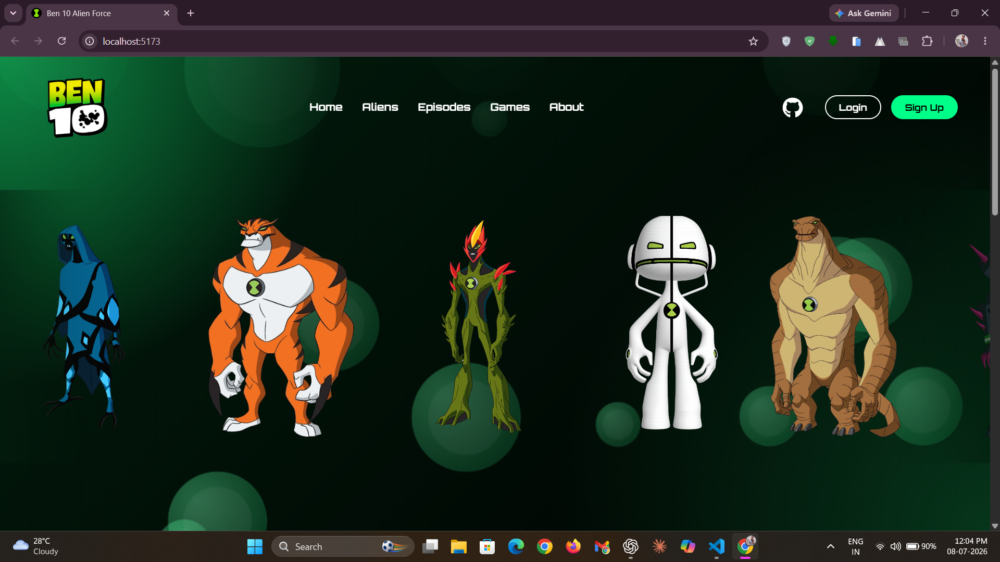
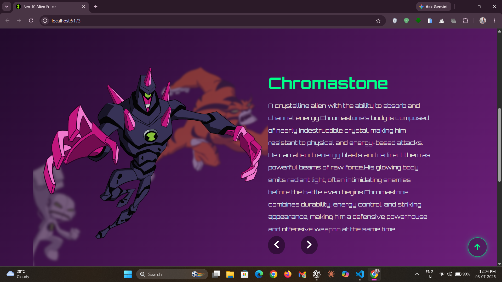
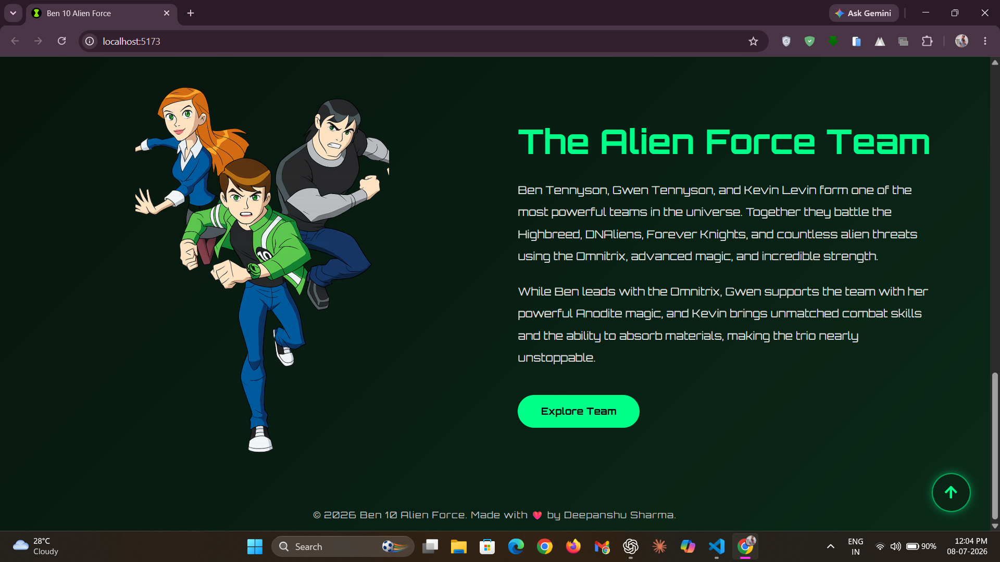
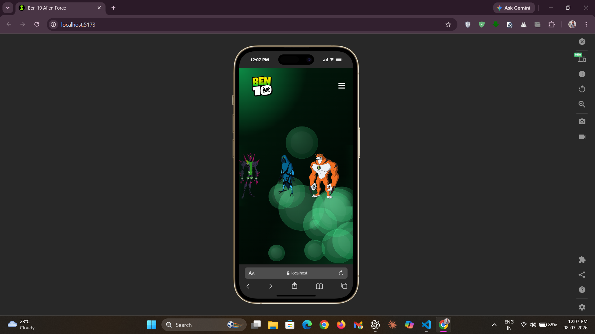

# 👽 Ben 10 Alien Force


**Ben 10** is a modern, interactive, and fully responsive fan-made website inspired by the iconic `Ben 10 Alien Force` series. Built with **React** and **Vite**, it blends cinematic animations, dynamic visuals, and seamless navigation into an immersive web experience.

**🌐 See your favorite Ben 10 aliens in action :** [Live Demo](https://ben10universe.vercel.app/)

# ✨ Features / Highlights

### 🚀 Interactive Navigation

- Smooth scrolling navigation between sections.
- Responsive `hamburger menu` for tablets and mobile devices.
- Auto-hiding navbar while scrolling.
- Quick GitHub access along with Login and Sign Up buttons.

### 🎬 Animated Hero Section

- Infinite scrolling alien carousel.
- Beautiful animated floating bubble background.
- Modern responsive layout.

### ⚡ Interactive Alien Showcase

- Explore multiple Alien Force transformations including:
  - Swampfire
  - Humungousaur
  - Big Chill
  - Echo Echo
  - Chromastone
  - Rath
  - Terraspin
- Dynamic gradient backgrounds that change with each alien.
- Smooth animated transitions using Framer Motion.
- 3D-inspired image positioning with scaling, blur, opacity, and depth effects.

### 🛡️ Alien Force Team

- Dedicated section introducing:
  - Ben Tennyson
  - Gwen Tennyson
  - Kevin Levin
- Character descriptions with clean responsive cards.
- Footer containing copyright information and GitHub profile.

### 📱 Responsive Design & ⬆️ Back to Top

- Fully responsive design optimized for **desktop, laptop, tablet, and mobile devices**.
- Floating `Back to Top` button appears after scrolling and provides smooth navigation back to the top of the page.

# 📸 Screenshots / Demo

> Take a look at some screenshots showcasing the website.

### 🏠 Home


*The landing page featuring an animated hero section, smooth navigation, and an immersive Ben 10 experience.*

### 👾 Aliens Showcase


*Explore iconic Ben 10 aliens with dynamic backgrounds, cinematic animations, and interactive transitions.*

### 👥 Team Showcase


*Meet the Alien Force team, including Ben Tennyson, Gwen Tennyson, and Kevin Levin in a dedicated showcase section.*

### 📲 Responsive Design


*Optimized for desktop, tablet, and mobile devices to deliver a seamless experience across all screen sizes.*

# 🛠️ Tech Stack Used

- 💻 **Language:** JavaScript (ES6+)
- ⚛️ **Frontend:** React v19
- ⚡ **Build Tool:** Vite
- 🎬 **Animation Library:** Framer Motion
- 🎨 **Styling:** Vanilla CSS
- 🖼️ **Icon Library:** React Icons
- 🧹 **Code Quality:** ESLint
- 🔗 **Deployment:** Vercel

# ⚙️ Setup & Installation

> To set up and run the project locally, follow these steps below:

### 1️⃣ Clone the repository

```bash
git clone https://github.com/deepanshu1420/Ben10.git
```

### 2️⃣ Navigate to the project directory

```bash
cd Ben10
```

### 3️⃣ Install the required dependencies

```bash
npm install
```

### 4️⃣ Start the development server

```bash
npm run dev
```

✅ **That's it!** The project should now be running locally at:

```text
http://localhost:5173
```

Open the URL in your browser and start exploring the `Ben 10 Alien Force` experience. ☄️